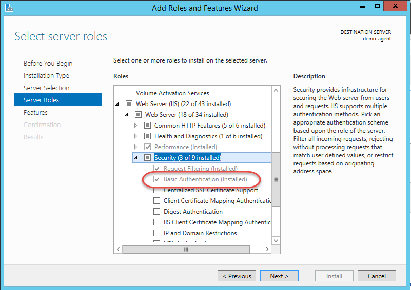
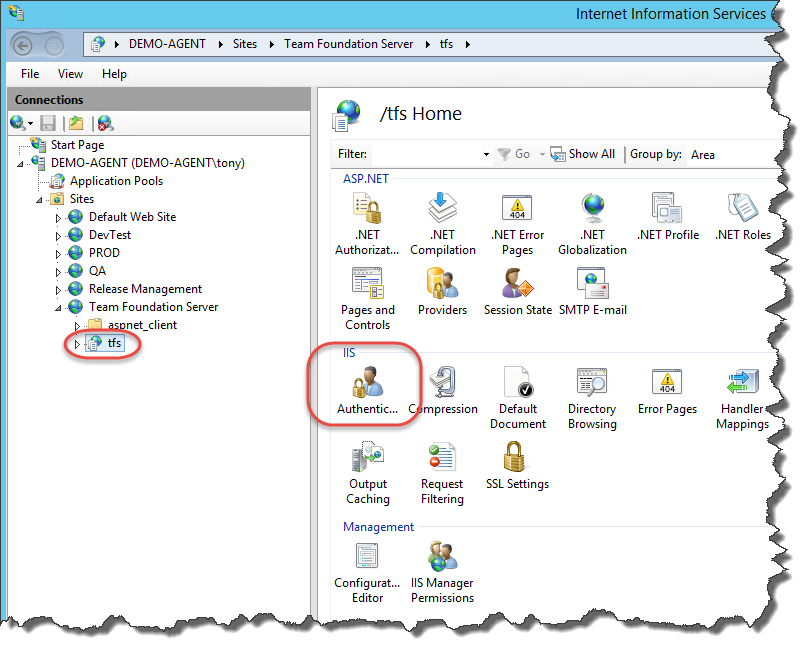
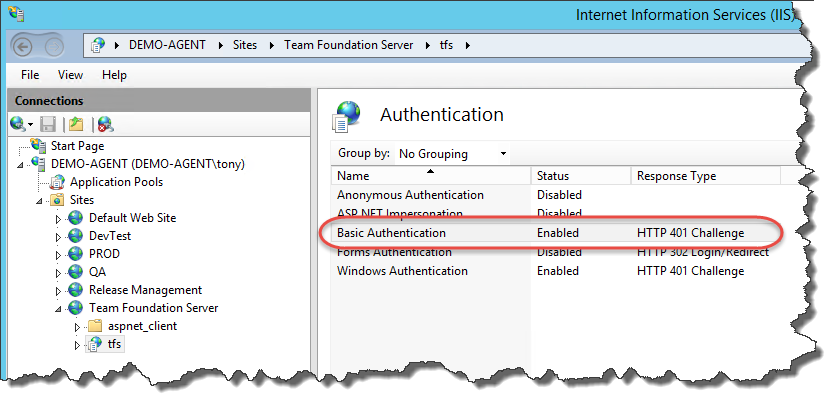

#Using `tfx` against Team Foundation Server (TFS) 2015 using Basic Authentication
In order to use `tfx` against TFS on-premises, you will need to enable basic authentication in the tfs virtual application in IIS. _This is a temporary solution until NTLM authentication is supported._

> **WARNING!!** Basic authentication sends usernames and passwords in plaintext. You should consider [configuring TFS to use SSL](https://msdn.microsoft.com/en-us/library/aa833872.aspx) in order to enable secure communication when using basic auth.

##Configuring TFS to use Basic Authentication
Follow these steps to enable basic auth for your TFS:

1. Install the `Basic Authentication` feature for IIS in Server Manager. 
2. Open IIS Manager and expand to the `Team Foundation Server` website, and then click on the `tfs` virtual application. Double-click the `Authentication` tile in the Features view 
3. Click on `Basic Authentication` in the list of authentication methods. Click `Enable` in the right hand column. You should now see `Basic Authentication` enabled. 
4. **Note**: leave the `domain` and `realm` settings for `Basic Authentication` empty.

##`tfx login` with Basic Authentication
Now you can start to use `tfx` against your TFS server. You'll want to `login` before issuing commands.

1. Type `tfx login --auth-type basic`
2. You will be prompted to add your service Url.
3. You will be prompted for your username. Use `domain\user` (e.g. fabrikam\peter). If you are on a workgroup machine, use `machinename\username`.
4. You will be prompted for your password. Enter the password for the username you entered.

You can now use any other `tfx` commands.
```
> tfx login --auth-type basic
Copyright Microsoft Corporation

Enter service url > http://localhost:8080/tfs/defaultcollection
Enter username > fabfiber\peter
Enter password > *******
logged in successfully
```